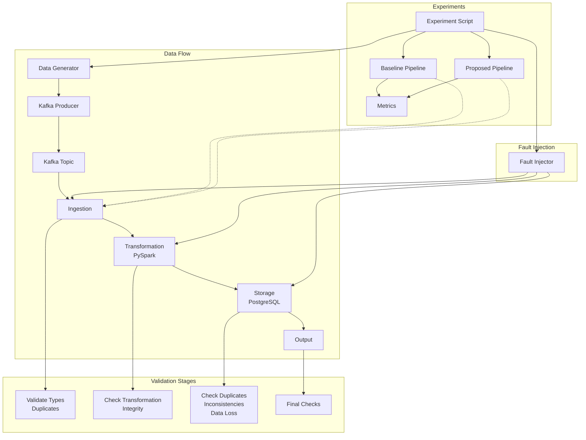

# Architecture

## Pipeline Stages
1. Ingestion
2. Preprocessing / Schema Enforcement
3. Transformation
4. Storage / Serving
5. Downstream Validation

## Baseline vs Proposed
- Baseline: direct passthrough, no reconciliation, no integrity checks
- Proposed: stage-aware validation, metrics + anomaly detection, reconciliation checks

## Components
- Data Generator (ecommerce event model) in `data_generator/order_events.py`
- Fault injection: missing, duplicates, corruption, schema drift, out-of-order
- Storage: DuckDB (local) as curated data store
- Optional integration paths: Kafka ingestion, PostgreSQL storage (via `configs/config.py`)

## Diagram

```mermaid
graph LR
    A[Data Generator] --> B[Fault Injector]
    B --> C[Ingestion]
    C --> D[Preprocessing]
    D --> E[Transformation]
    E --> F[Storage]
    F --> G[Downstream Validation]

    subgraph Baseline
      C1[Ingestion (bare)]
      D1[Preprocessing (bare)]
      E1[Transform (simple)]
      F1[Storage (duckdb)]
      G1[Minimal output checks]
    end

    subgraph Proposed
      C2[Ingestion (schema, null, freshness)]
      D2[Preprocessing (types)]
      E2[Transform (assertions, mappings)]
      F2[Storage (row count, checksum)]
      G2[Reconciliation, KPI consistency]
    end

    C --> C1
    C --> C2
    D --> D1
    D --> D2
    E --> E1
    E --> E2
    F --> F1
    F --> F2
    G --> G1
    G --> G2
```

## Diagram



## Components

- **Data Generator**: Creates synthetic data using Faker.
- **Fault Injector**: Injects data loss, duplication, corruption, and inconsistencies.
- **Kafka**: Messaging for data ingestion.
- **PySpark**: Data transformation.
- **PostgreSQL**: Data storage.
- **Validation**: Checks for integrity issues.
- **Experiments**: Compares pipelines and outputs metrics.