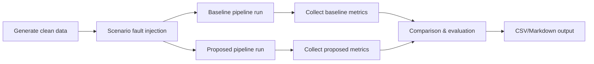

# Experiment Workflow

1. Generate deterministic base data with seed.
2. Apply scenario-specific faults.
3. Run baseline pipeline (batch mode).
4. Run proposed pipeline (batch mode).
5. Collect stage metrics, detected issues, and latency.
6. Output to `reports/experiment_results.csv` and `reports/experiment_results.md`.

## Mermaid Flow

